# ℹ️ Features

* Project Browser customization:
  * Context menu
  * Icons
* Configurable project wide defaults and per-user overrides.

# 📦 Install

## Package Manager + Git

1. Open Package Manager
2. Paste GitHub URL:\
`https://github.com/Smidgenomics/unity-pview.git#<tag_or_commit>`


## Git Submodule (Embedded Package)

From the project root run the following:\
`git submodule add git@github.com:Smidgenomics/unity-pview.git Packages/com.smidgenomics.unity-pview`

# 🚀 Usage

In all cases, customizing the Project View involves `.json` profiles files read from `ProjectSettings/pview/` or `UserSettings/pview/`.

Menu profiles end with `.pvm.json` and icon profiles with `.pvi.json`.

## Project Settings

Project settings override Unity's default behaviour for all users of the project unless otherwise is configured in User Settings (see below).

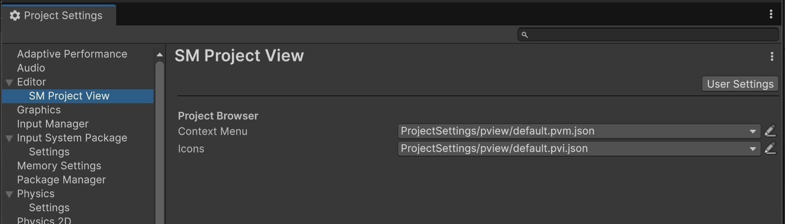


## User Settings

User settings allow you to override project defaults, change how they're used, or disable them entirely.

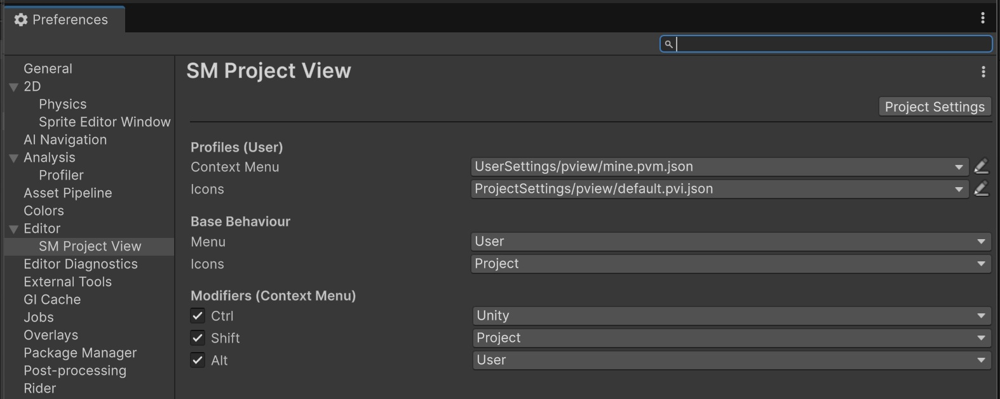

## Context Menu

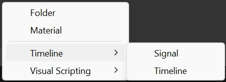

Custom menus are json files that can be read from either `ProjectSettings/pview/` or `UserSettings/pview/`. 

`*.pvm.json`
```json
{
	"root":{
		"items":[
			{
				"$type":"cmd",
				"cmd":"Assets/Create/Folder"
			},
			{
				"$type":"cmd",
				"cmd":"Assets/Create/Material"
			},
			null,
			{
				"$type":"cmd",
				"label":"Timeline",
				"cmd":"*Timeline*"
			},
			{
				"$type":"cmd",
				"label":"Visual Scripting",
				"cmd":"*Visual Scripting*"
			}
		]
	},
}
```

### Adding Items

Included item types: 
* `group`
* `cmd`
* `new`
* `fn`

**Notes**:

* Menu paths are hierarchical, so an item's label will always be prefixed by that of its parent group (`Group 1/Group 2/Item 1` etc.)
* `null` items add separators.
* If the `$type` field is omitted on items its value will default to `group`.

---

#### `$type`=`group`|`null`

`items:MenuItem[]`

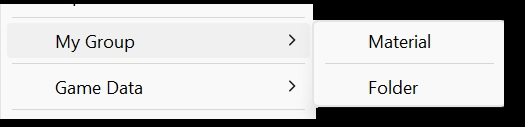

Contains an array of items.

```json
{
	"label":"My Group",
	"items":[
		{
			"$type":"cmd",
			"cmd":"Assets/Create/Folder"
		},
		null,
		{
			"$type":"cmd",
			"cmd":"Assets/Create/Material"
		}
	]
}
```


#### `$type`=`cmd`

`path:string`

Adds options that execute menu commands.

**Notes:**
* If no `label` value is supplied, the command name will be used instead (ex: `Assets/Create/Folder` -> `Folder`).
* For wildcard/regex, `label` 

**Example**: Absolute path to command:
```json
{
	"$type":"cmd",
	"cmd":"Assets/Create/Folder"
}
```

**Example**: Wildcard:
```json
{
	"$type":"cmd",
	"cmd":"Assets/Create/*"
}
```

**Example**: Regex:

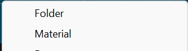

```json
{
	"$type":"cmd",
	"cmd":"^Assets\/Create\/Material|Folder$"
}
```


#### `$type`=`create`
`classType:string`|`subClasses:bool`

Adds menu create options for configured type(s).

* `classType` can either be an assembly qualified name or an asset GUID referring to a Scriptable Object's MonoScript asset.
* If `subClasses` is set to `true`, a menu item will be created for each subclass of configured type, using `label` as a group if supplied.
* If `label` is left empty, and specified type has `[CreateAssetMenu]` defined, its values will be used for the label and default name.

**Example**:  Create instance of specific type

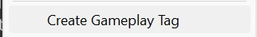

```json
{
	"$type":"new",
	"label":"Create Gameplay Tag",
	"classType":"Game.CoreGameSO,Game.Core"
}
```


**Example**: Add create option for every subclass

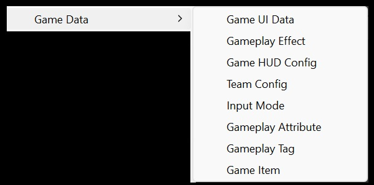

```json
{
	"$type":"new",
	"label":"Game Data",
	"classType":"Game.CoreGameSO,Game.Core",
	"subClasses":true
}
```


#### `$type`=`fn`
`fn:string`


Populates menu with output from static function. The function is referenced using its name and owning type.

```json
{
	"$type":"fn",
	"label":"Actions",
	"fn":"GetCustomActions; MyGame.MyClass,Smidgenomics.Unity.ProjectView.Editor"
}
```

The following method signatures are supported:
* `void fn()` (single option)
* `IEnumerable<ValueTuple<string,Action>> fn()` (multiple options)


## Asset Icons
`extends:string`|`rules:Dictionary<string,IconConfig>`

Browser icons are configured using a set of rules.

Icon profile (`*.pvi.json`):
```json
{
	"extends":"ProjectSettings/pview/ourdefault.pvi.json",
	"rules":{
		...
	}
}
```

Icon config:
```json
{
	"icon":"<guid_or_name>",
	"tint":"#fff",
	"coords":"0,0,1,1"
}
```


**Example**: Set icon for specific asset (GUID)

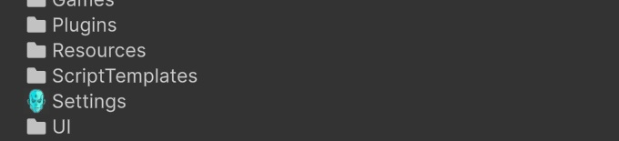

```json
"1cbab08d4eadedd4da924f66c02c3dac":{
	"icon":"b4508e266a1d41445a0cb18bd9acf8d6"
},
```


**Example**: Any folder named `Textures`

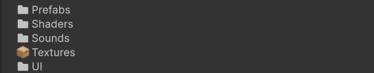

```json
"f:*/Textures":{
	"icon":"b4508e266a1d41445a0cb18bd9acf8d6"
}
```

**Example**: Any instance of type with name `GameplayTag`

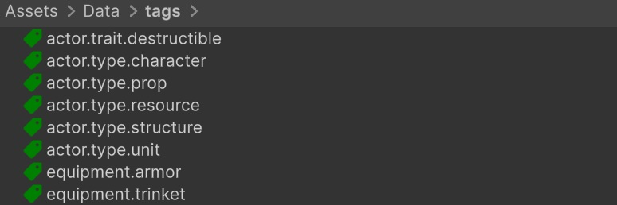

```json
"t:GameplayTag":{
	"icon":"1dbc26c96219eb34d87eecef7f383d9f",
	"tint":"green"
}
```

**Example**: Blender files

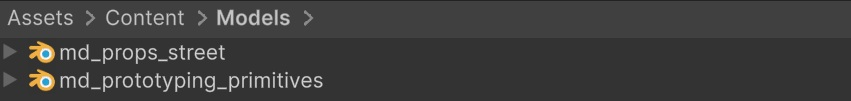

```json
"*.blend":{
	"icon":"482859d61bf410148ae3f6668c434350"
}
```
